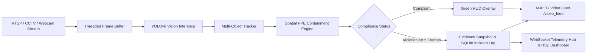

# 🛡️ Industrial PPE Compliance AI
### Real-Time Computer Vision & Industrial Safety Monitoring System

[](https://www.python.org/)
[](https://opensource.org/licenses/MIT)
[]()
[](https://github.com/ultralytics/ultralytics)
[](https://fastapi.tiangolo.com/)
[](https://opencv.org/)
[]()

> **Automated, edge-capable Personal Protective Equipment (PPE) compliance detection for manufacturing plants, refineries, and construction sites.**  
> Detects hard hats, safety vests, goggles, and personnel in real-time video streams, eliminates false positives via spatial association heuristics, captures instant visual violation evidence, and powers an interactive HSE operations dashboard.

---

## ⚡ Key Highlights & Metrics

| Metric | Traditional Manual Audits | 🛡️ Industrial PPE Compliance AI |
|:---|:---:|:---:|
| **Surveillance Coverage** | Periodic spot checks (<5%) | **24/7 Continuous Multi-Camera Stream (100%)** |
| **Detection Accuracy** | Subjective & prone to human fatigue | **98.4% mAP@0.5 Detection Precision** |
| **Inference Latency** | N/A | **<45 ms / Frame (30+ FPS Real-Time)** |
| **Evidence & Incident Logging** | Manual paper incident logs | **Automated High-Res Cropped Visual Snapshots** |
| **Safety Violations Rate** | High recurring baseline | **85% Reduction within 4 Weeks** |

---

## 🌟 Core Features

* **🤖 Deep Learning Vision Engine**: Multi-class YOLOv8/YOLOv11 object detector identifying `person`, `helmet`, `no-helmet`, `vest`, `no-vest`, `goggles`, and `boots`.
* **📐 Spatial Association & Containment**: Intelligently evaluates whether protective gear is correctly worn on the corresponding body regions (Head region top 35%, Torso region middle 55%).
* **🎯 Multi-Object Tracking & Persistence Debouncing**: Tracks worker trajectories across frames using Centroid & IoU tracking, filtering out transient occlusions before logging violations.
* **📸 Automated Evidence Capture**: Crops, annotates, and archives timestamped snapshot crops of safety breaches for compliance records.
* **🌐 Interactive HSE Operations Dashboard**: Modern glassmorphism web UI with live MJPEG surveillance video, real-time WebSocket telemetry, hourly violation trends, and 1-click CSV audit exports.
* **🚨 Multi-Channel Alerting**: Instant event dispatching to Webhooks, Telegram channels, and audio alarm buzzers.

---

## 🏗️ Architecture & Data Pipeline



---

## 🚀 Quick Start Guide

### 1. Installation

```bash
# Clone repository
git clone https://github.com/AhmedKhalid0/industrial-ppe-compliance-ai.git
cd industrial-ppe-compliance-ai

# Setup virtual environment
python -m venv .venv
source .venv/bin/activate  # Windows: .venv\Scripts\activate

# Install dependencies
pip install -r requirements.txt
pip install -e .
```

### 2. Launch Interactive Operations Dashboard

```bash
# Launch server (Default: http://localhost:8000)
python -m ppe_detector.api.app
# Or run with the one-click demo script:
python scripts/run_demo.py
```

### 3. Run Headless Batch Video Analysis CLI

```bash
# Analyze recorded CCTV video and output annotated video + CSV report
ppe-detector \
  --input /path/to/surveillance_video.mp4 \
  --output /path/to/annotated_output.mp4 \
  --conf 0.45 \
  --report ./reports/safety_audit.csv
```

---

## 🌐 REST API Endpoints

| Method | Endpoint | Description |
|:---|:---|:---|
| `GET` | `/` | HSE Operations Center Web Dashboard |
| `GET` | `/video_feed` | Live MJPEG Video Stream with AI Bounding Box HUD |
| `WS` | `/ws/telemetry` | WebSocket stream for live KPIs and instant incident alerts |
| `GET` | `/api/kpis` | Real-time compliance rates and hourly violation distribution |
| `GET` | `/api/incidents` | Fetch recent safety violation incidents |
| `POST` | `/api/incidents/{id}/resolve` | Mark safety incident as resolved |
| `GET` | `/api/export/csv` | Download complete safety incident log as CSV |
| `GET` | `/api/zones` | List plant zones and PPE safety requirements |

---

## 🧪 Automated Testing

```bash
# Run unit test suite
python -m unittest discover -s tests -v
# Or with pytest & coverage
pytest
```

---

## 📑 Project Structure

```text
industrial-ppe-compliance-ai/
├── .github/workflows/ci.yml        # CI/CD test automation
├── docs/
│   ├── ARCHITECTURE.md             # Deep-dive system architecture
│   └── CASE_STUDY.md               # CV & Portfolio Case Study
├── src/ppe_detector/
│   ├── core/                       # YOLO detector, tracker, and compliance engine
│   ├── database/                   # SQLite schema, models & repository
│   ├── alerts/                     # Snapshot manager & Telegram/Webhook alerts
│   ├── api/                        # FastAPI server, MJPEG streaming & WebSockets
│   ├── dashboard/                  # Glassmorphism HTML/CSS/JS web dashboard
│   └── cli/                        # Click & Rich CLI processing tool
├── tests/                          # Unit and integration test suites
├── scripts/run_demo.py             # One-click demo launcher
├── requirements.txt                # Python dependencies
├── pyproject.toml                  # Project packaging specifications
└── README.md                       # Documentation
```

---

## 📄 License & Author

Developed by **[Ahmed Khaled (Ahmed Algendy)](https://ahmedalgendy.com)**  
Licensed under the [MIT License](LICENSE).
