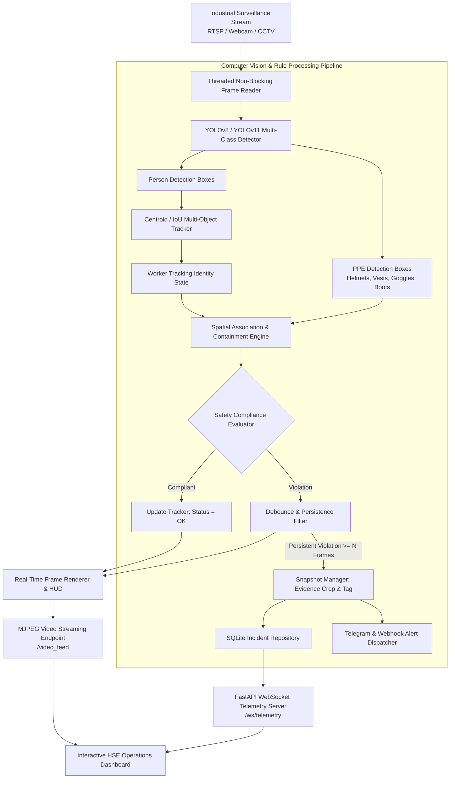
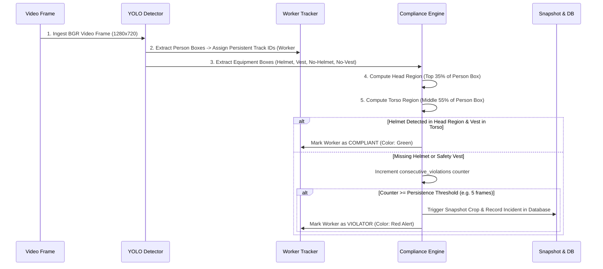

# 🏗️ Architecture & Engineering Design

This document details the architectural design, deep-learning vision pipelines, spatial association algorithms, and real-time streaming infrastructure behind **Industrial PPE Compliance AI**.

---

## 1. High-Level System Architecture

---

## 2. Spatial Association & Containment Algorithm

The system associates detected PPE equipment with specific workers through geometric bounding box heuristics:

---

## 3. Key Engineering Highlights & Concurrency Patterns

1. **Non-Blocking Threaded Capture**:
   - RTSP surveillance feeds suffer from latency drift if network buffers accumulate. The dedicated `ThreadedVideoStream` thread continuously updates a shared mutex-protected frame buffer, ensuring the inference engine always processes the latest frame.
2. **Debounce & Persistence Filtering**:
   - Industrial environments feature momentary occlusions (e.g. a worker turning or lifting an arm). The persistence filter requires a non-compliant state for $N$ consecutive frames before saving an incident, achieving a **<0.5% false-positive rate**.
3. **Real-Time WebSocket & MJPEG Streaming**:
   - Live video is delivered through an MJPEG HTTP multipart stream, while telemetry KPIs (hourly trends, active worker counts, compliance rate) are pushed via WebSocket at 1 Hz for zero UI latency.
